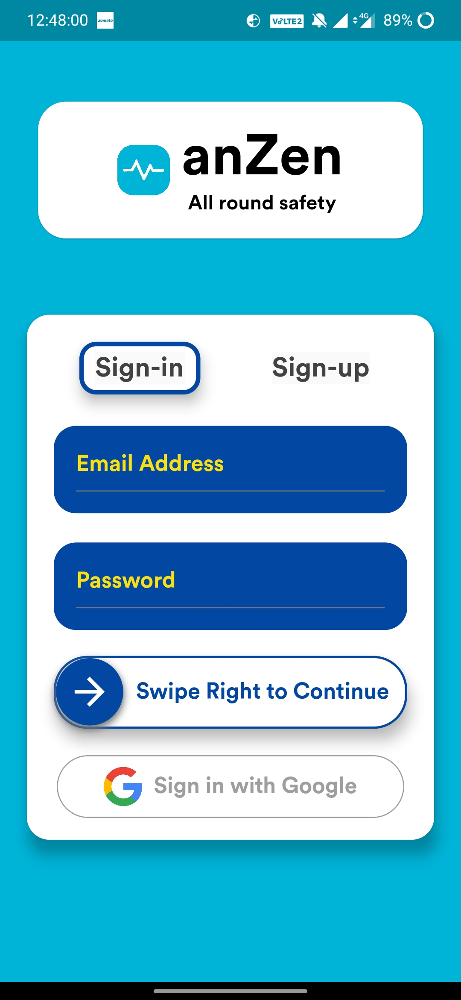
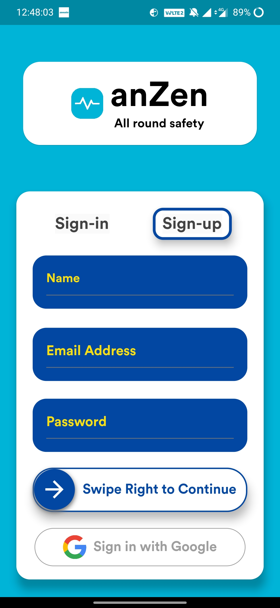
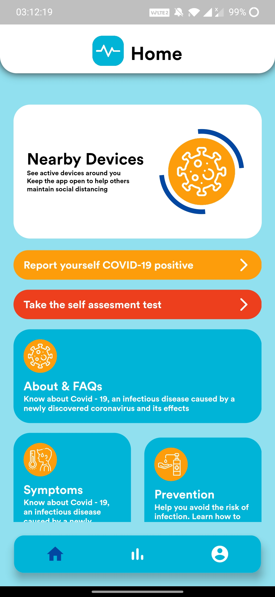
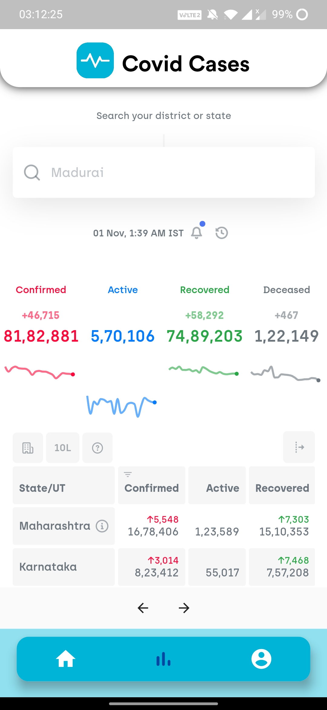
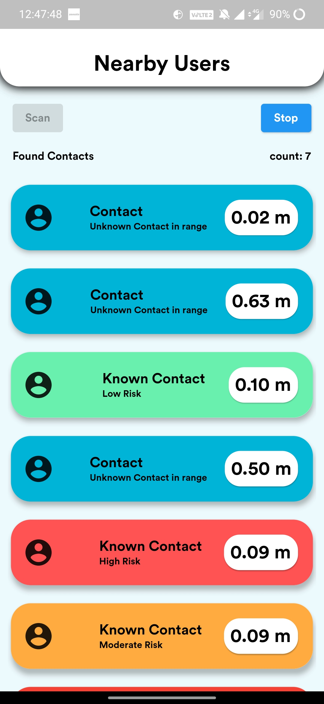
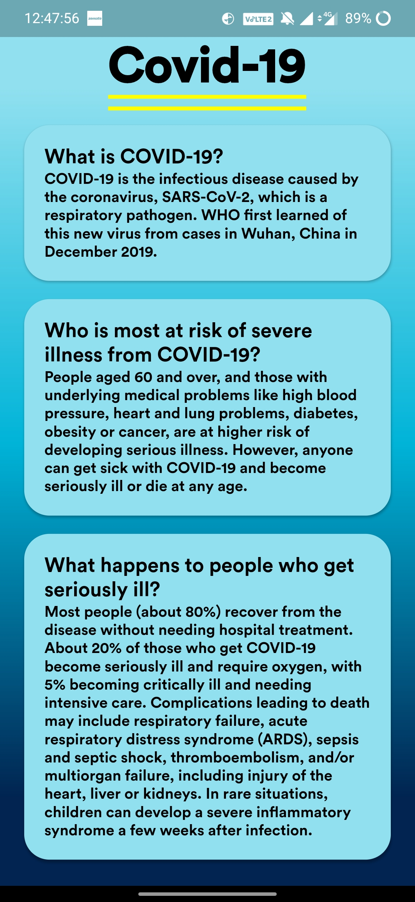

# AnZen the contact tracing app

This app gives realtime updates on social distancing, by notifying you the number of people around you and their health status using Bluetooth LE. It also uses the RSI values to give the distance of other devices from you in meters. Best part is that it works even without internet while scanning other devices.

Check live demonstration here: <a href="https://drive.google.com/file/d/1JKi4_yuoSJRnBeMPR4Wx_-5ShC92YuLf/view?usp=sharing">Click Here</a>

## Screenshots
<table>
  <tr>
<td>
</td>
  <td>
</td>
  </tr>
<tr>
<td>
</td>
  <td>
</td>
</tr>
  <tr>
<td>
</td>
  <td>
</td>
  </tr>
  
  
<table>
